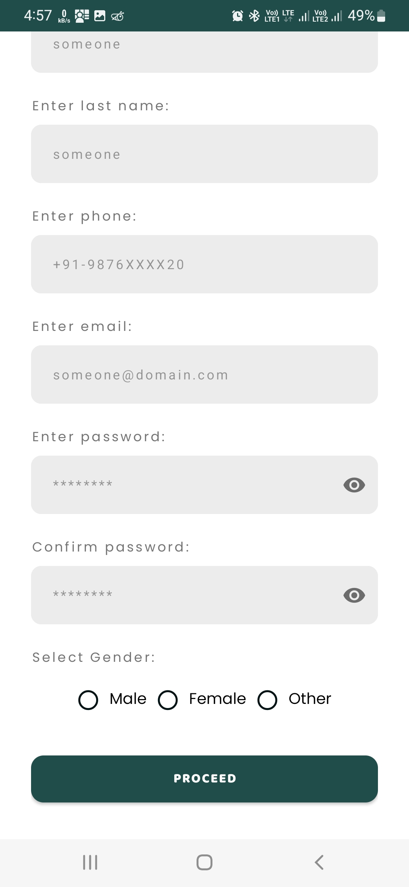
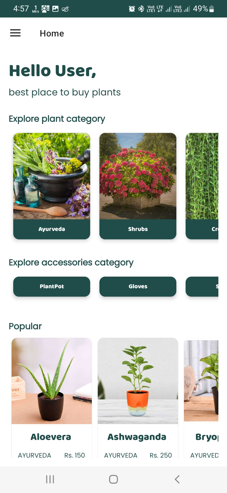
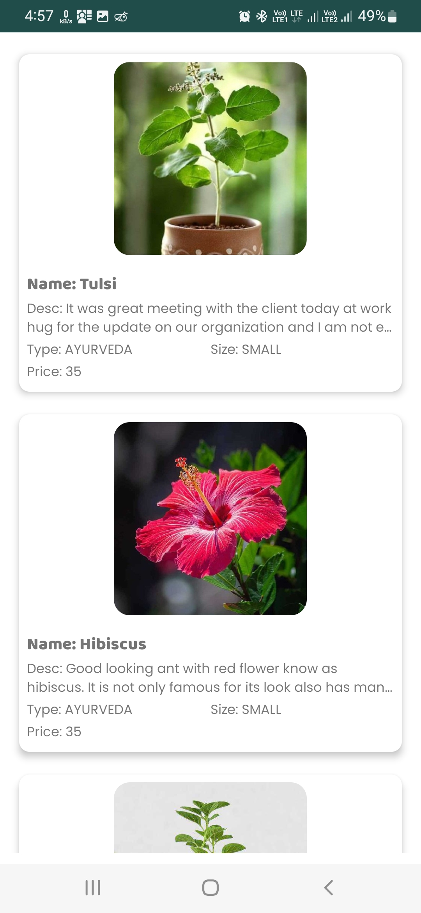
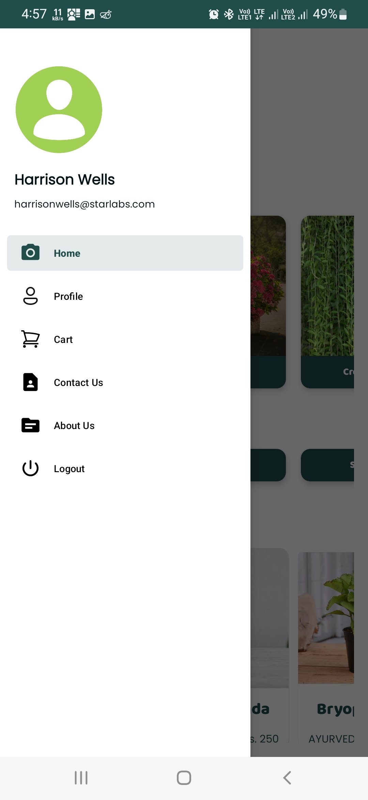
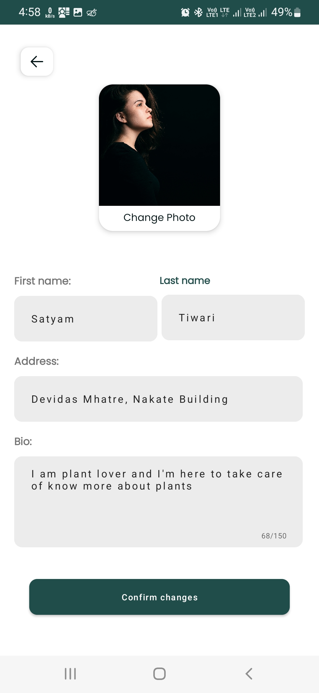

# DrPlantae
<b>DrPlantae</b> application allow the users to buy the plants and buy care products and accessories of the plants from the online portal
<pre>
           
           
           
          
           
        
</pre>
